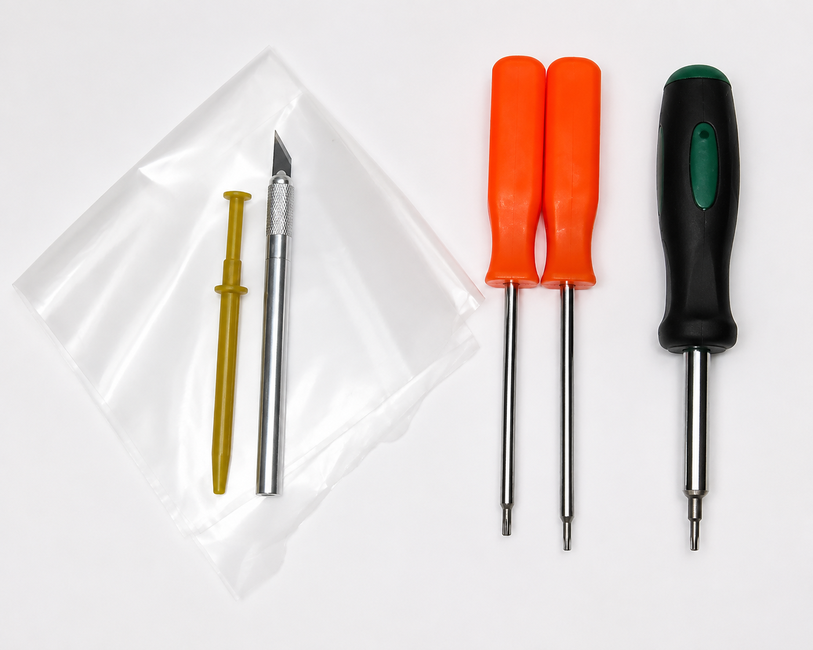
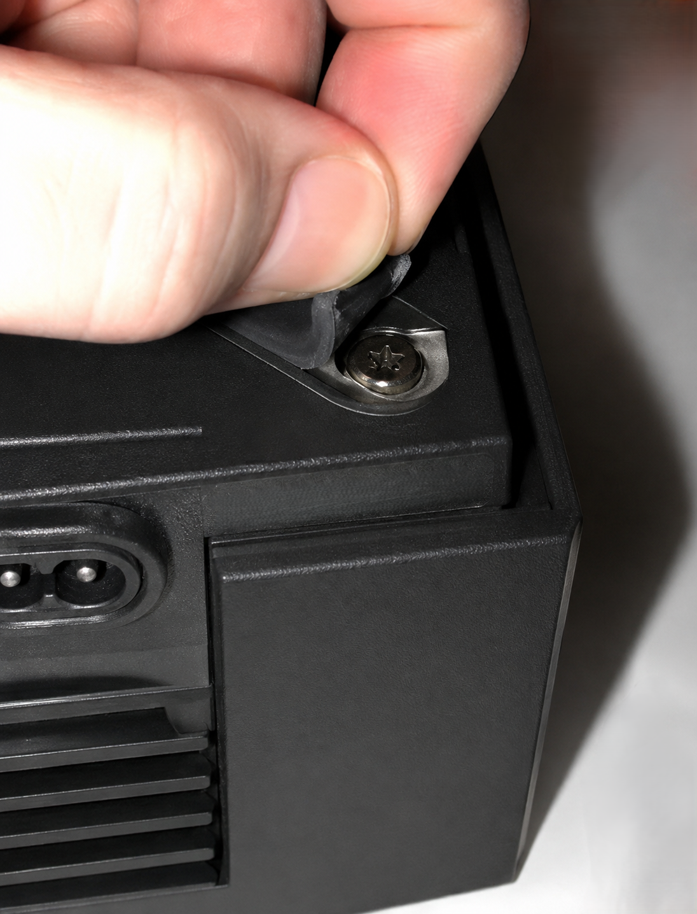
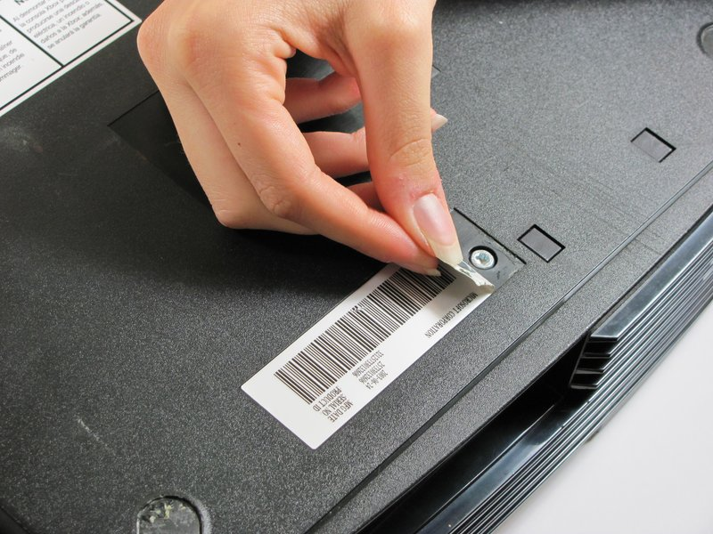
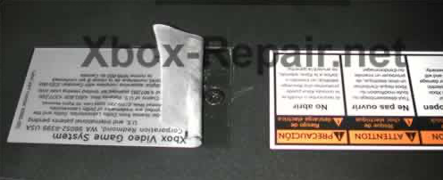
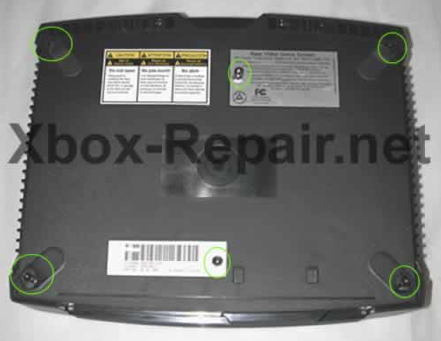
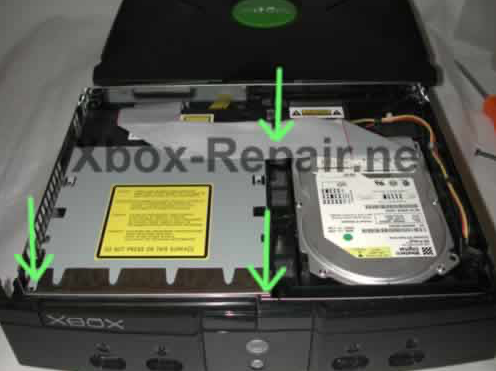
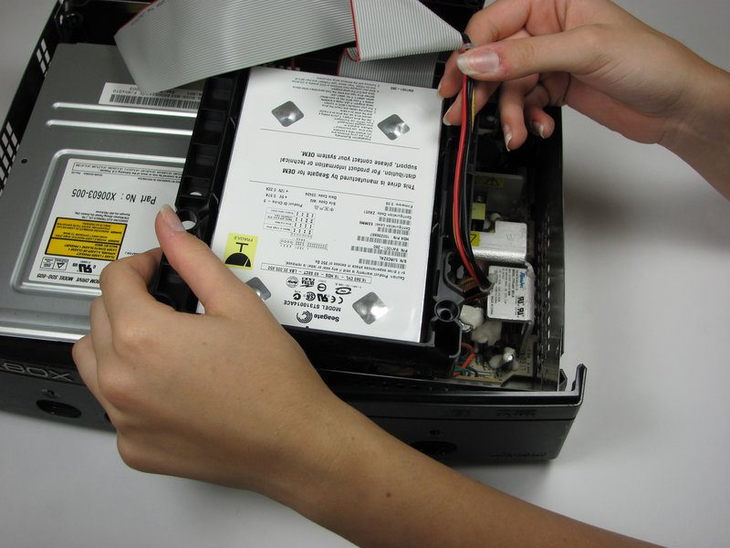
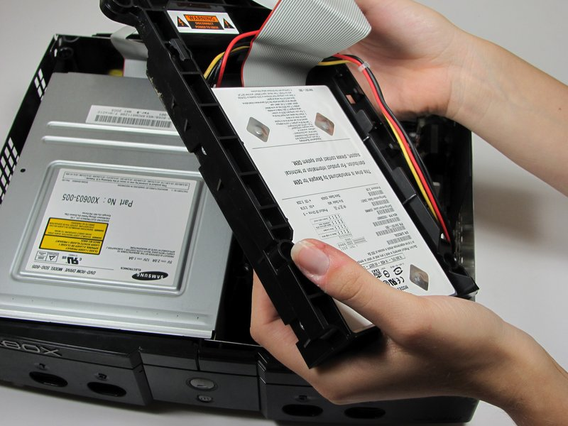
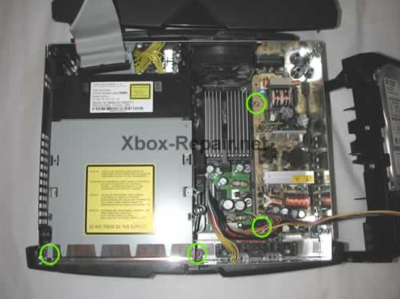
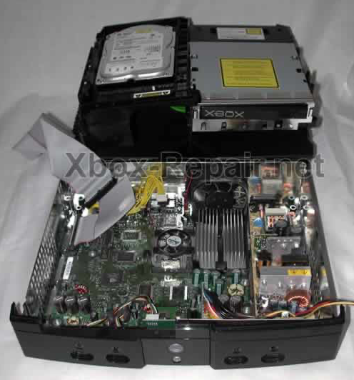

# Part 1: Opening Your Xbox

Before the Kratos boards can be installed, the Xbox needs to be opened up and the drives removed so the front panel is accessible.

## Step 1: Prepare the Console

1. Work in a clean, well-lit area, and use an anti-static mat if available
2. Disconnect all cables from the Xbox
3. Place the console on a flat, stable surface
4. Organize your Kratos components and tools

Don't be tempted to make do with a flathead screwdriver or Allen key in place of proper Torx drivers - you'll only frustrate yourself and chew up the screws. Alongside the required T20 and T10, a hobby knife and some wax paper are handy for dealing with the labels and feet, and an insulated screw grabber makes retrieving screws easier.

## Step 2: Peel Back the Rubber Feet

Flip the Xbox upside down. Four of the case screws are hidden under the rubber feet.

Peel back just the outer edge of each foot, leaving the rest of the adhesive stuck down to hold it in place - wedging the tip of the T20 driver under the edge and twisting works well. Once you can reach the screw, start unscrewing and let the screw itself push the foot out of the way, rather than peeling it back further than necessary.

## Step 3: Peel Back the Labels

- There are 2 more screws hidden under the two labels on the bottom of the case
- You can either remove the labels or simply feel for the screw holes through the labels and then cut or punch a hole through them

**Note:** Disturbing these labels may void any remaining warranty.

## Step 4: Remove the Case Screws and Lift Off the Top Shell

Using the T20 Torx driver, remove all six case screws - four under the feet and two under the labels.

Once all six screws are out, flip the Xbox upright, grab the sides and give it a gentle shake - the bottom will drop away from the top cover (this is easiest done over your lap). Lift off the top shell, being cautious of the internal components and fragile wires underneath.

## Step 5: Remove the Drive Screws

Three T10 screws hold both drives in place: one for the hard drive, tucked under the IDE cable, and two on either side of the front of the DVD drive.

## Step 6: Remove the Hard Drive

1. Unplug the IDE cable from the hard drive
2. Free the power cord from the track it sits in on the drive tray - the drive won't come out if you miss this. The cord itself can stay plugged into the hard drive; it's long enough to set the drive aside

3. Lift the hard drive carrier straight up and out. There's no easy way to grab it - a finger in the hole at the front right of the carrier and your other hand grasping the rear works well

## Step 7: Remove the DVD Drive

1. Disconnect the IDE cable and the yellow cable from the motherboard
2. With the hard drive out of the way, remove the two screws at the front of the DVD drive if you haven't already

3. Lift the drive straight up and out. It doesn't slip out easily, but with the two front screws and both rear cables removed it will come free

With both drives out, your Xbox is now open with the front panel accessible, ready for the next stage.

---

[← Hardware Installation](hardware-installation.md) | [Next: Part 2 - Removing the Original Front Panel →](hardware-2-removing-the-original-front-panel.md)
