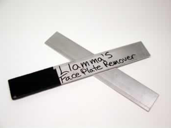
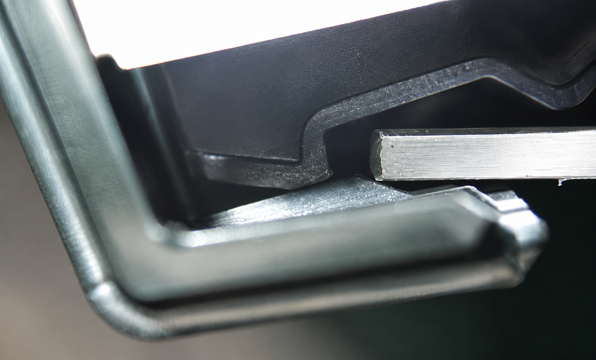
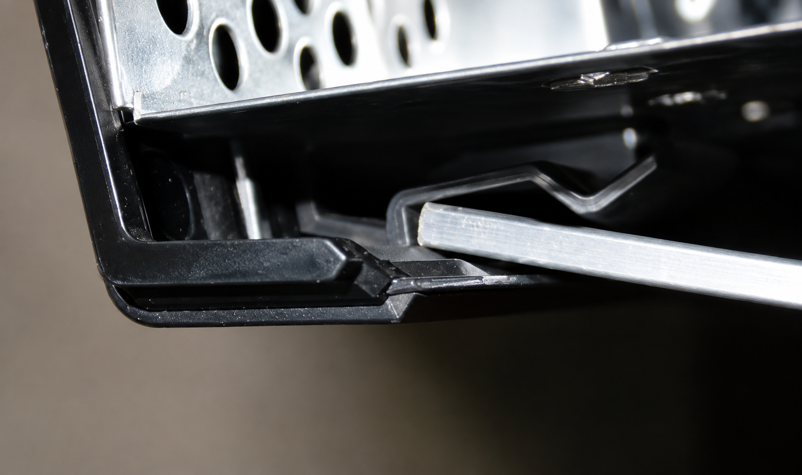
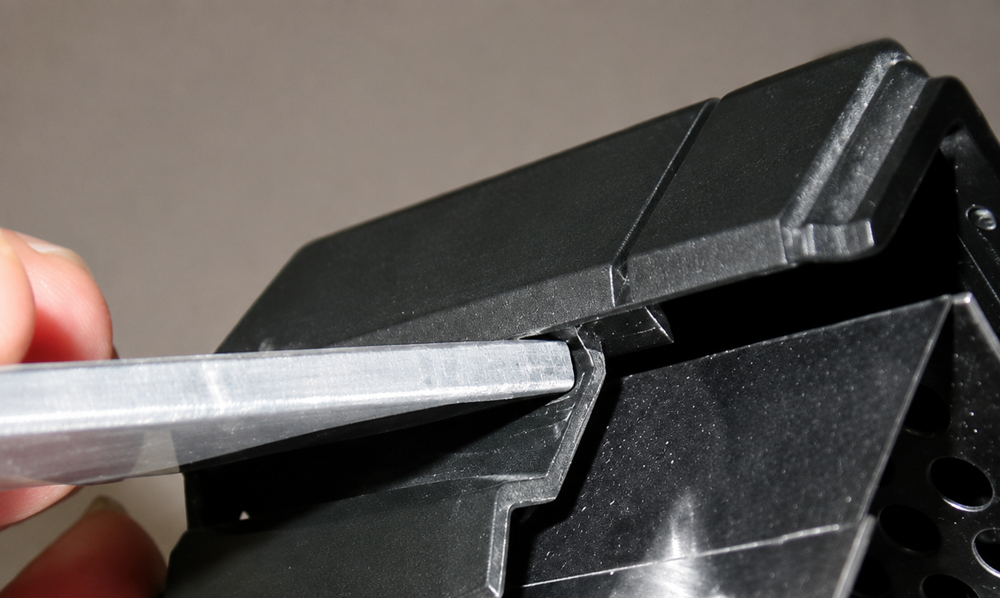
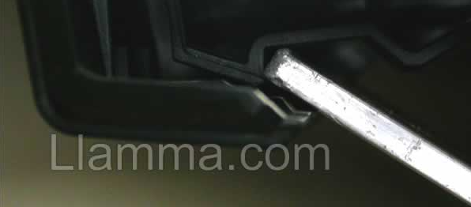
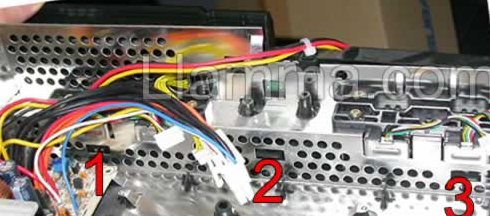
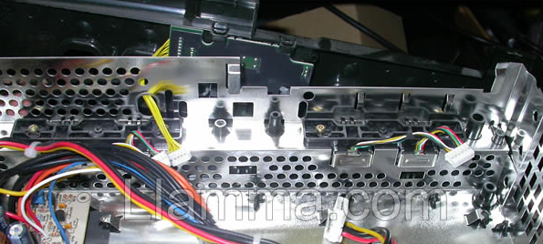

# Part 2: Removing the Original Front Panel

With the console open and the drives removed, the front panel (bezel/face plate) can now be removed.

**Take your time with this part.** The front panel is held on by three plastic tabs that are easy to break, and prying carelessly can crack or gouge the case.

## Step 1: Disconnect the Front Panel Cable

Disconnect the yellow cable coming from the front panel. While you're there, take note of the three tabs along the bottom front on the inside of the case - these are what hold the panel on.

**Tip:** You don't need to remove the USB daughter board or USB connections, but you can if it makes reaching the tabs easier.

## Step 2: Choose a Prying Tool

Use something wide and flat to pry with. A narrow tool like a screwdriver will gouge the plastic, and a metal ruler is usually too thin. A piece of aluminium bar stock (around 1½" wide and ⅛" thick) works well.

## Step 3: Pop the Right Side Loose

1. Starting at the right front corner, slide the tool in between the front panel and the case

2. Push the tool all the way forward

3. Pry outwards

4. The right side of the panel will pop loose

## Step 4: Release the Three Tabs

Release the three tabs one at a time while gently twisting the face forward, away from the console - 1, 2, 3, pop pop pop.

## Step 5: Panel Removed

The front panel is now free of the console.

With the bezel off, the original front button panel board is accessible - disconnect any remaining connections and remove the board, ready for the Kratos Main Board.

---

[← Previous: Part 1 - Opening Your Xbox](hardware-1-opening-your-xbox.md) | [Next: Part 3 - Installing the Kratos Main Board →](hardware-3-installing-the-kratos-main-board.md)
