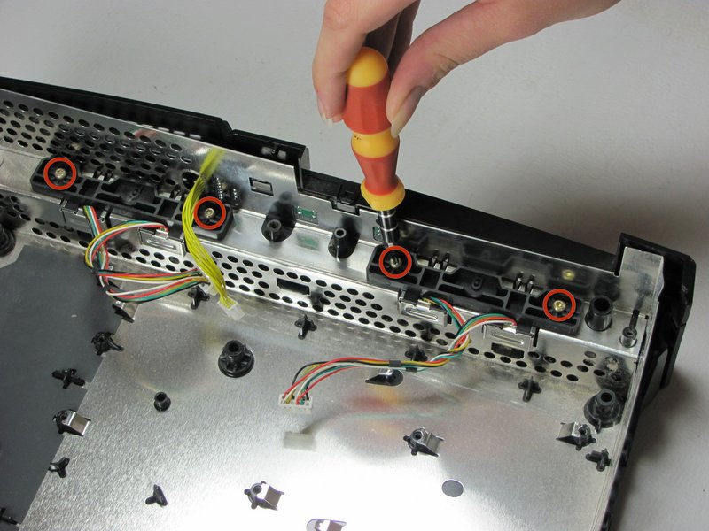

# Part 3: Preparing the Controller Ports

With the front panel off, the original controller ports need to be removed and stripped of their shielding ready for the Kratos Controller Boards.

## Step 1: Remove the Controller Ports

1. Disconnect the controller port wire harnesses if you haven't already
2. Remove the four screws securing the controller port assemblies to the front of the chassis
3. Lift the controller port assemblies out

## Step 2: Remove the Shielding from the Controller Ports

Remove the metal shielding from each controller port assembly.

---

[← Previous: Part 2 - Removing the Original Front Panel](hardware-2-removing-the-original-front-panel.md) | [Next: Part 4 - Installing the Kratos Main Board →](hardware-4-installing-the-kratos-main-board.md)
