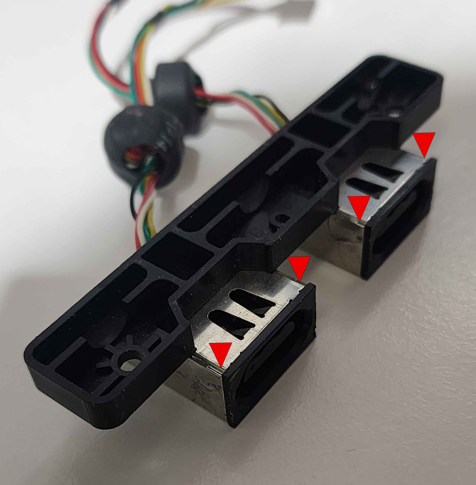
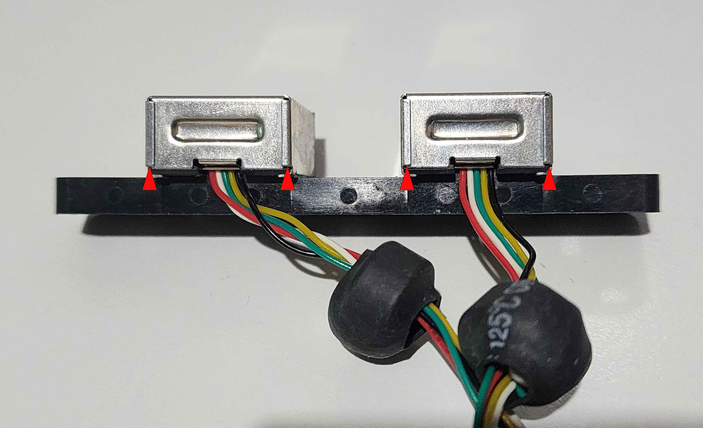
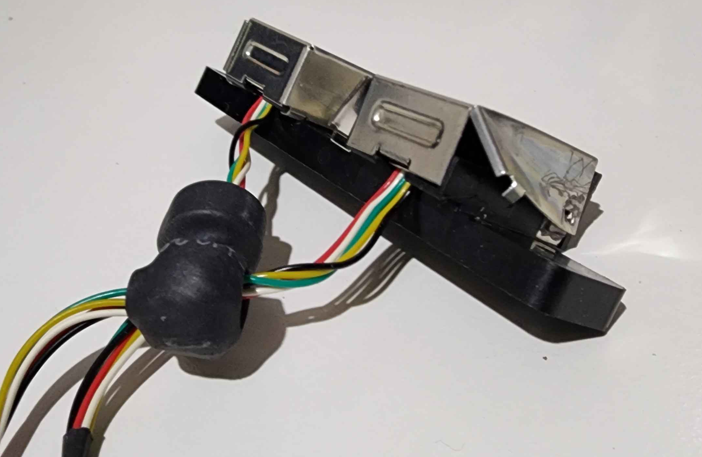
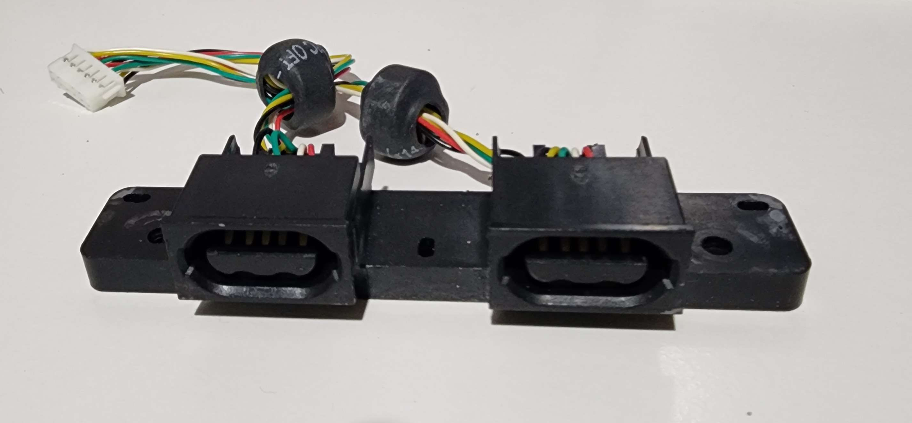

# Part 3: Preparing the Controller Ports

With the front panel off, the original controller ports need to be removed and stripped of their shielding ready for the Kratos Controller Boards.

## Step 1: Remove the Controller Ports

1. Disconnect the controller port wire harnesses if you haven't already
2. Remove the four screws securing the controller port assemblies to the front of the chassis
3. Lift the controller port assemblies out

## Step 2: Remove the Shielding from the Controller Ports

The metal shielding on each controller port is held on by solder joints. There are two ways to remove it:

### Method 1: Non-Destructive

Desolder the points shown below and the shielding will lift away intact.

### Method 2: Destructive

Pry open the shielding at the points shown below. Once pried enough, the solder joints will snap and the shell will come off.

## Step 3: Shielding Removed

With the shielding removed, the controller ports should look like this:

---

[← Previous: Part 2 - Removing the Original Front Panel](hardware-2-removing-the-original-front-panel.md) | [Next: Part 4 - Preparing the Kratos Main Board →](hardware-4-installing-the-kratos-main-board.md)
