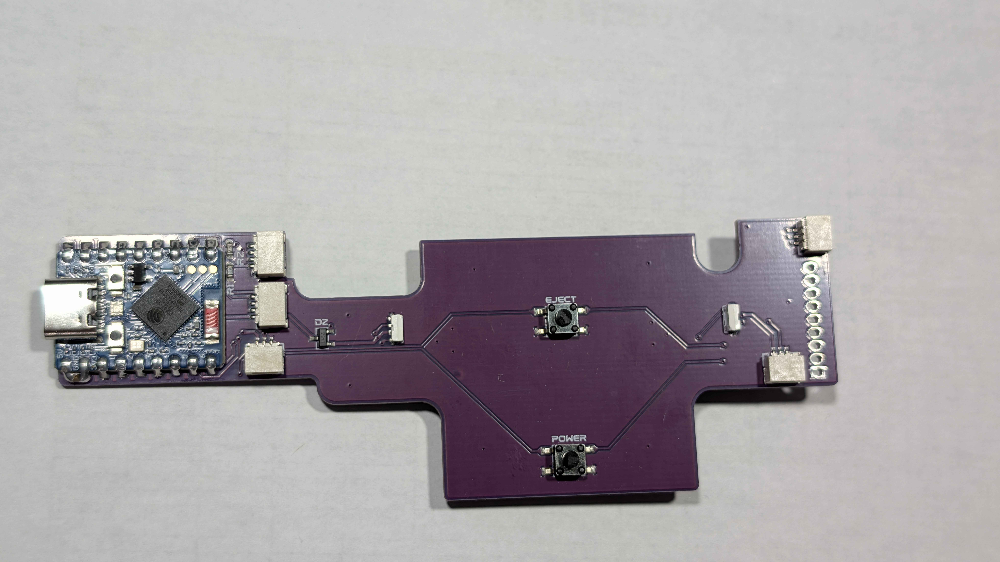
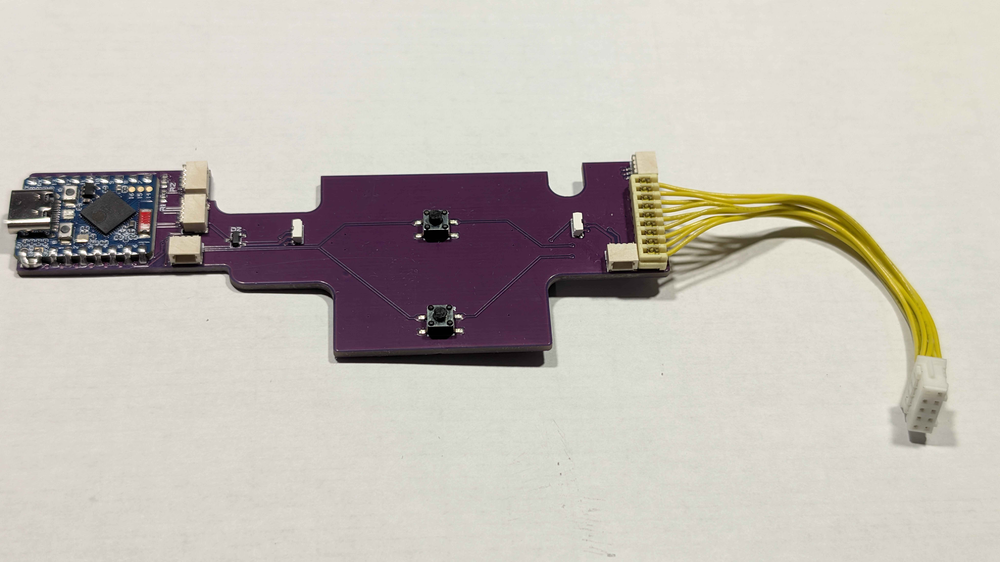
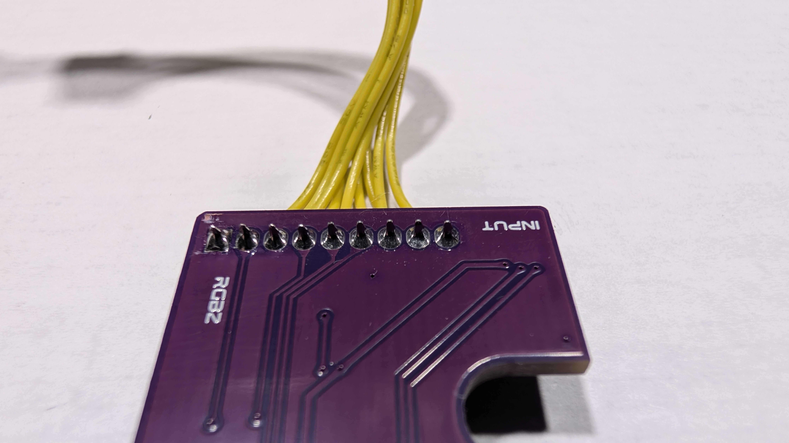

# Part 4: Preparing the Kratos Main Board

The Kratos Main Board uses the same 9-pin connector as the original front panel board, so the connector has to be transferred across before the board can go in. It is soldered in place and its wires sit in slot contacts, so this step needs patience rather than force.

**You will need:** a soldering iron, solder, desoldering braid or a solder sucker, flux, and isopropyl alcohol with a soft brush for cleaning up afterwards.

**Use plenty of flux.** Fresh flux makes the old solder flow at a lower temperature and for longer, so you spend less time heating the pads and are far less likely to lift one. It is worth using on both the desoldering and the soldering.

## Step 1: Unclip the Original Board from the Front Panel

The original front button panel board clips into the back of the front panel you removed in Part 2. Release the clips and lift the board away - it should come out without any force.

## Step 2: Desolder the 9-Pin Connector

The connector needs to come off the original board intact so it can be reused on the Kratos Main Board.

**Do not try to free it by pulling on the cable.** The wires are held in slot contacts, so pulling will drag the wires out of the connector housing instead of lifting the connector off the board.

Instead:

1. Apply flux to all nine joints on the underside of the board, and add a little fresh solder to each one - mixing new solder into the old joints helps them melt more evenly
2. Heat the solder joints from the underside of the board
3. As the solder softens, use a blade or the tip of a pair of side cutters to gently lever the connector body up from underneath
4. Work along the pins a little at a time, easing the connector up gradually rather than trying to lift it in one go

## Step 3: Solder the Connector to the Kratos Main Board

The salvaged connector fits the matching footprint on the Kratos Main Board.

1. Clear any leftover solder from the connector pins with braid so they drop cleanly into the holes
2. Flux the pads on the Kratos board
3. Seat the connector fully so it sits flush against the board and check the orientation matches the footprint
4. Solder all nine pins, aiming for shiny, cone-shaped joints that fill the hole

## Step 4: Clean Up and Check

Flux residue is sticky and can be mildly corrosive, so clean it off once you are done. Brush the joints with isopropyl alcohol (99% works best) and a soft brush, wipe away the residue, and let the board dry fully before it goes anywhere near power.

With the connector fitted and cleaned up, the Kratos Main Board should look like this and is ready to install:

---

[← Previous: Part 3 - Preparing the Controller Ports](hardware-3-preparing-the-controller-ports.md) | [Next: Part 5 - Installing the Controller Boards →](hardware-5-installing-the-controller-boards.md)
