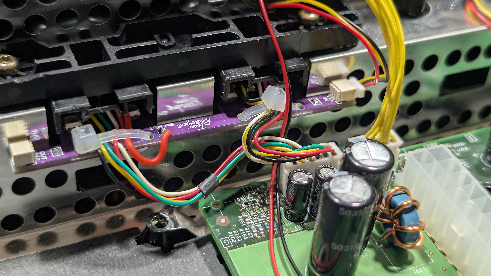

# Part 4: Preparing the Controller Ports

With the front panel off, the original controller ports need to be removed and stripped of their shielding. The Kratos Controller Boards then slide in behind the ports before everything is screwed back down.

## Step 1: Remove the Controller Ports

1. Disconnect the controller port wire harnesses if you haven't already
2. Remove the four screws securing the controller port assemblies to the front of the chassis
3. Lift the controller port assemblies out

## Step 2: Remove the Shielding from the Controller Ports

The metal shielding on each controller port is held on by solder joints. There are two ways to remove it:

### Method 1: Non-Destructive

Desolder the points shown below and the shielding will lift away intact.

### Method 2: Destructive

Pry open the shielding at the points shown below. Once pried enough, the solder joints will snap and the shell will come off.

## Step 3: Shielding Removed

With the shielding removed, the controller ports should look like this:

## Step 4: Fit the Left Controller Board

**Note:** Left and right are as you face the front of the console. Working from behind, as you will be here, the right-hand board is the one on your left.

1. Bridge the solder link beside **RGB1** on the board, leaving the link beside **OUT** alone - see the [Pinout Reference](reference-pinout.md) if you are unsure which is which
2. Slide the Kratos left Controller Board into place behind the controller ports
3. Refit the controller port assemblies and secure them with the four screws removed in Step 1
4. Reconnect the controller port wire harnesses
5. Optionally, fit cable ties to take the strain off the connectors

## Step 5: Fit the Right Controller Board

The right-hand board needs a 5V feed wired in before it goes in place.

1. Solder a wire from the red 5V pad on the port 4 controller port board to the pad marked **5V ALT** on the Kratos right Controller Board
2. Bridge the solder link beside **RGB2** on the same board, leaving the link beside **OUT** alone - see the [Pinout Reference](reference-pinout.md) if you are unsure which is which
3. Slide the board into place behind the controller ports
4. Refit the controller port assemblies and secure them with their screws
5. Reconnect the controller port wire harnesses
6. Optionally, fit cable ties for strain relief

---

[← Previous: Part 3 - Removing the Original Front Panel](hardware-3-removing-the-original-front-panel.md) | [Next: Part 5 - Preparing the Kratos Main Board →](hardware-5-preparing-the-kratos-main-board.md)
