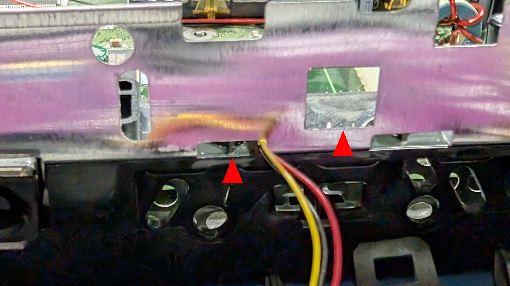
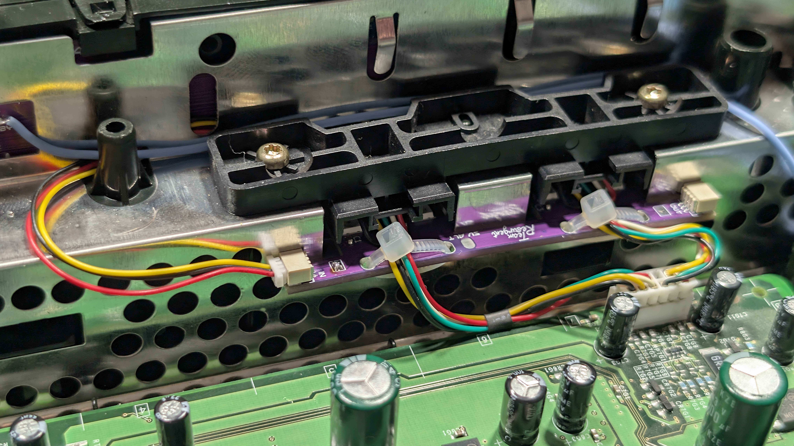

# Part 5: Refitting the Front Panel

With the Kratos Main Board clipped into the front panel, the panel can go back on the console. The cables need routing through the chassis first, otherwise they will be trapped or pinched when the panel clips home.

## Step 1: Route the Right-Hand Cables

Feed the right-hand RGB cable and the 9-pin cable that plugs into the Kratos **INPUT** header through the oblong hole in the chassis.

## Step 2: Solder the 5V Standby Wire

Solder a 30cm length of wire to the **5V STDBY** pad on the back of the Kratos Main Board, arrowed below. The generous length leaves enough slack to reach its connection point later.

## Step 3: Route the Left Controller Port Cable and 5V Standby Wire

Feed the left controller port cable through the rectangular hole in the shielding at the front left, and the 5V standby wire through the square hole.

## Step 4: Clip the Front Panel Back On

With everything routed and nothing trapped, line the front panel up with the console and clip it back into place - the three tabs along the bottom locate first, then the panel presses home.

## Step 5: Connect the 5V Standby Wire

With the panel in place, the standby wire can be run to the motherboard and cut to fit.

1. Route the wire around the controller port as shown below

2. Cut it to length once you are happy with the route, leaving a little slack rather than pulling it tight
3. Strip the end and solder it to the 5V standby point on the motherboard

---

[← Previous: Part 4 - Preparing the Kratos Main Board](hardware-4-installing-the-kratos-main-board.md) | [Next: Part 6 - Connecting the Modxo Harness →](hardware-6-connecting-the-modxo-harness.md)
