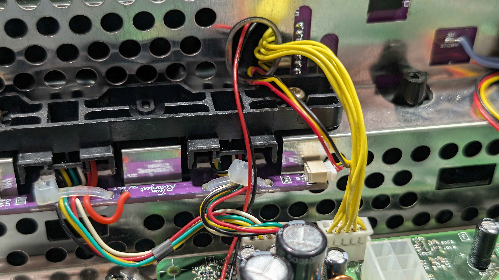

# Part 6: Refitting the Front Panel

With the Kratos Main Board clipped into the front panel, the panel can go back on the console. The cables need routing through the chassis first, otherwise they will be trapped or pinched when the panel clips home.

## Step 1: Route the Right-Hand Cables

Feed the right-hand RGB cable and the 9-pin cable that plugs into the Kratos **INPUT** header through the oblong hole in the chassis.

## Now Pick Your Console Revision

The remaining steps differ depending on your console revision - 1.6 consoles need a 5V standby wire, earlier ones do not. Follow the one that matches your console, then carry on to Part 7.

- **[Part 6a: Xbox 1.0 to 1.5](hardware-6a-refitting-the-front-panel-1-0-1-5.md)**
- **[Part 6b: Xbox 1.6](hardware-6b-refitting-the-front-panel-1-6.md)**

---

[← Previous: Part 5 - Preparing the Kratos Main Board](hardware-5-preparing-the-kratos-main-board.md)
