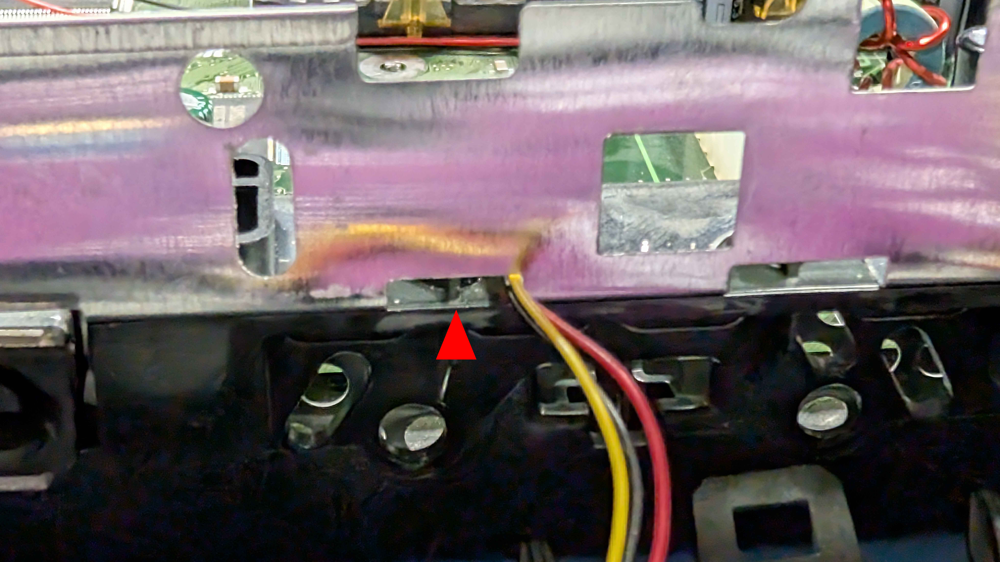

# Part 6a: Refitting the Front Panel - Xbox 1.0 to 1.5

Continuing from Step 1 in [Part 6](hardware-6-refitting-the-front-panel.md), these are the remaining steps for consoles from revision 1.0 to 1.5. No 5V standby wire is needed on these consoles.

## Step 2: Route the Left Controller Port Cable

Feed the left controller port cable through the rectangular hole in the shielding at the front left.

## Step 3: Clip the Front Panel Back On

With everything routed and nothing trapped, line the front panel up with the console and clip it back into place - the three tabs along the bottom locate first, then the panel presses home.

---

[← Previous: Part 6 - Refitting the Front Panel](hardware-6-refitting-the-front-panel.md) | [Next: Part 7 - Connecting Kratos to the SMBus →](hardware-7-connecting-kratos-to-the-smbus.md)
