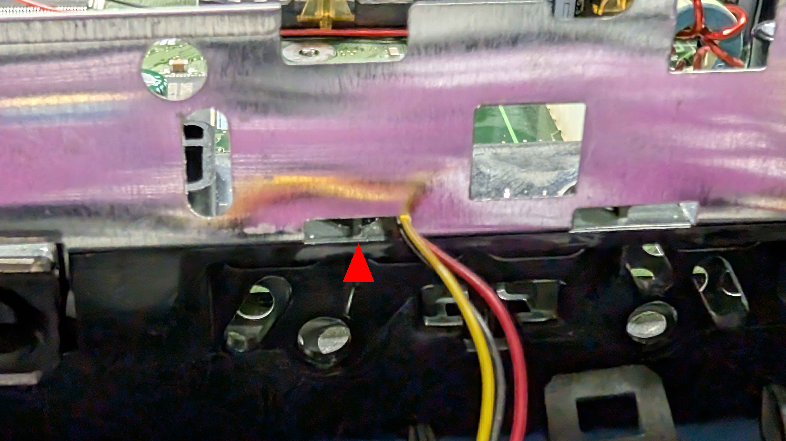

# Part 6a: Refitting the Front Panel - Xbox 1.0 to 1.5

Continuing from Step 1 in [Part 6](hardware-6-refitting-the-front-panel.md), these are the remaining steps for consoles from revision 1.0 to 1.5. Unlike a 1.6, these consoles do not need a 5V standby wire for Kratos to work, though Step 2 covers an optional feed worth fitting.

## Step 2 (Optional): Keep Kratos Powered While the Xbox Is Off

Consoles from 1.0 to 1.5 have no always-on 5V standby supply, so Kratos loses power whenever the console is switched off. Everything still works normally, but Kratos cannot listen out while the Xbox is off, so it cannot power the console on for you. If you want to turn the Xbox on wirelessly, give Kratos a permanent 5V feed in one of two ways.

**Option 1: Supply your own 5V**

Solder a wire from an always-on 5V source to the **5V STDBY** pad on the back of the Kratos Main Board, arrowed below. The source needs to be able to supply around 800mA.

**Option 2: Power Kratos over USB-C**

Leave a USB-C cable connected to the Kratos Main Board. It stays powered from the USB supply regardless of whether the Xbox is on.

As a suggestion, the cable can be routed out under one of the lower vents on the front panel, which keeps it out of sight and avoids cutting or drilling anything.

## Step 3: Route the Left Controller Port Cable

Feed the left controller port cable through the rectangular hole in the shielding at the front left.

## Step 4: Clip the Front Panel Back On

With everything routed and nothing trapped, line the front panel up with the console and clip it back into place - the three tabs along the bottom locate first, then the panel presses home.

---

[← Previous: Part 6 - Refitting the Front Panel](hardware-6-refitting-the-front-panel.md) | [Next: Part 7 - Connecting Kratos to the SMBus →](hardware-7-connecting-kratos-to-the-smbus.md)
