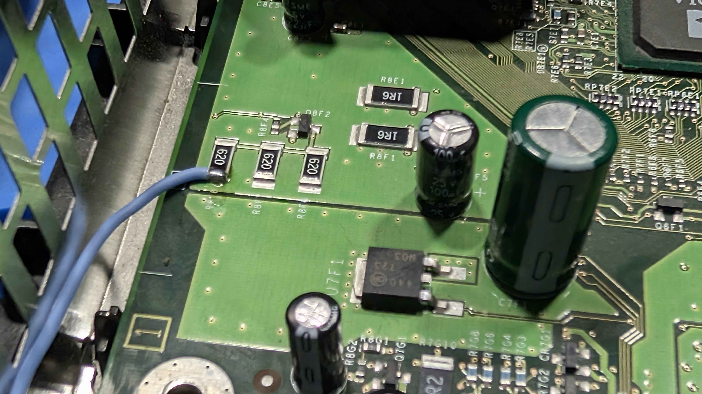

# Part 6b: Refitting the Front Panel - Xbox 1.6

Continuing from Step 1 in [Part 6](hardware-6-refitting-the-front-panel.md), these are the remaining steps for a revision 1.6 console. Steps 2 and 5 cover the 5V standby wire, which is what you want if Kratos is to power the Xbox on wirelessly - a 1.6 has an always-on 5V supply on the motherboard to take it from. Leave them out if you would rather not fit it.

## Step 2 (Optional): Solder the 5V Standby Wire

Solder a 30cm length of wire to the **5V STDBY** pad on the back of the Kratos Main Board, arrowed below. The generous length leaves enough slack to reach its connection point later.

## Step 3: Route the Left Controller Port Cable and 5V Standby Wire

Feed the left controller port cable through the rectangular hole in the shielding at the front left, and the 5V standby wire, if you fitted one, through the square hole.

## Step 4: Clip the Front Panel Back On

With everything routed and nothing trapped, line the front panel up with the console and clip it back into place - the three tabs along the bottom locate first, then the panel presses home.

## Step 5 (Optional): Connect the 5V Standby Wire

With the panel in place, the standby wire can be run to the motherboard and cut to fit.

1. Route the wire around the controller port as shown below

2. Cut it to length once you are happy with the route, leaving a little slack rather than pulling it tight
3. Strip the end and solder it to the 5V standby point on the motherboard

---

[← Previous: Part 6 - Refitting the Front Panel](hardware-6-refitting-the-front-panel.md) | [Next: Part 7 - Connecting Kratos to the SMBus →](hardware-7-connecting-kratos-to-the-smbus.md)
