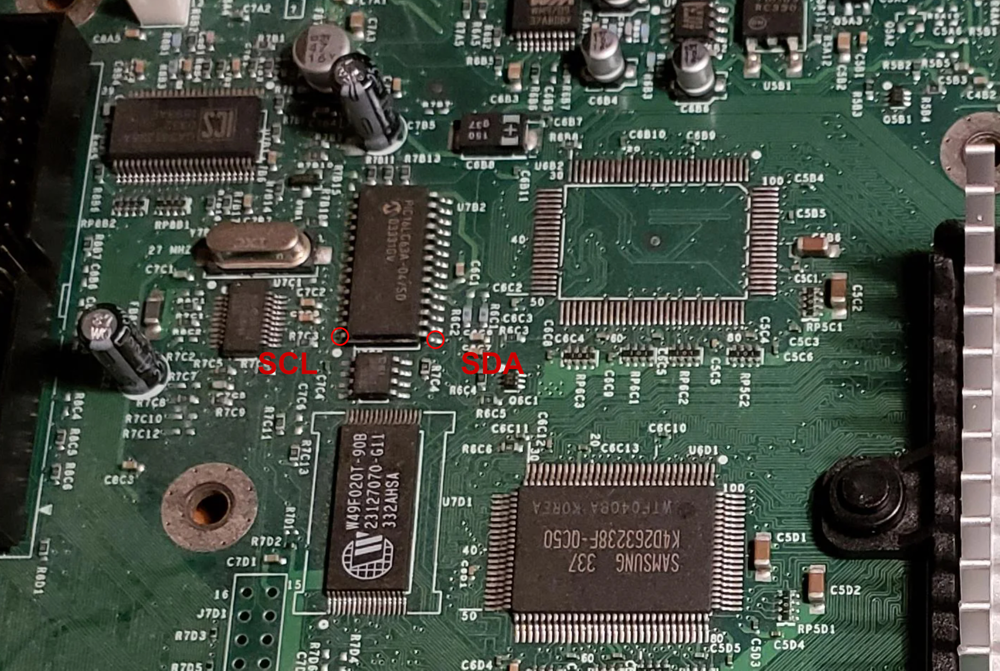
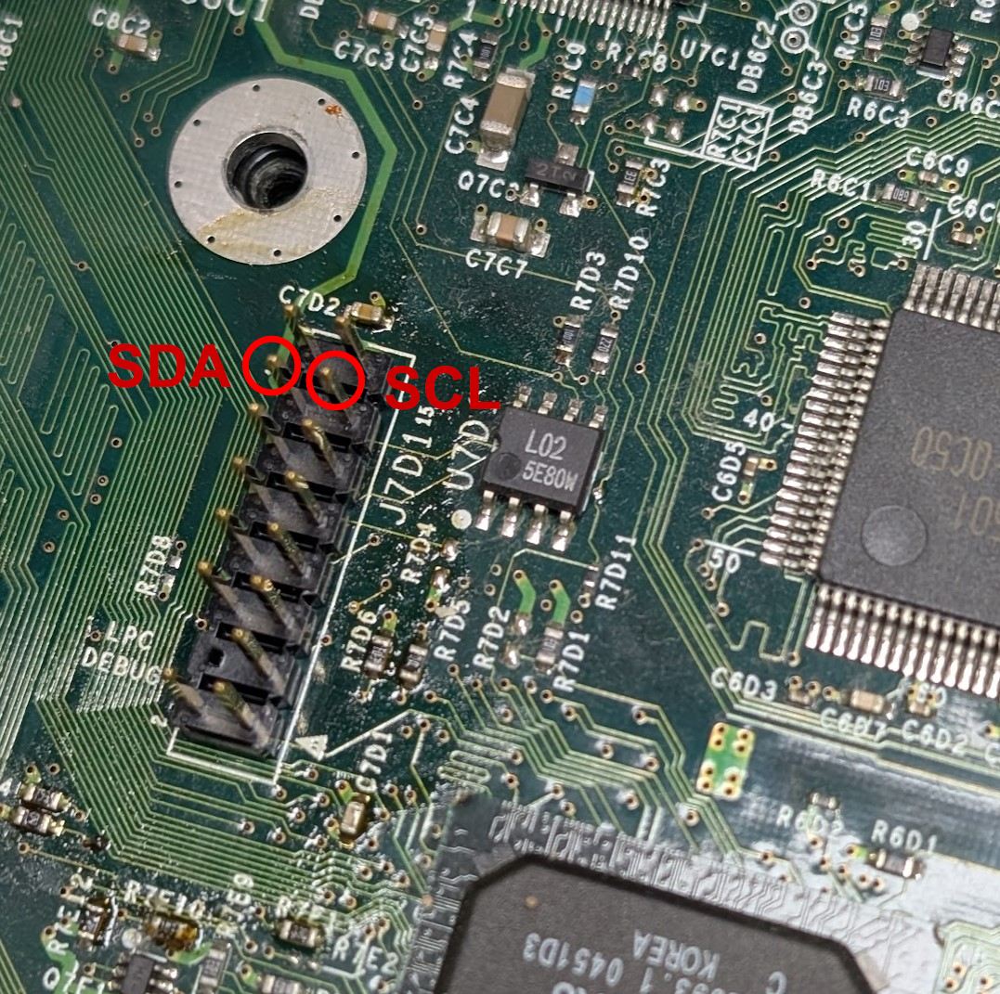

# Part 7: Connecting Kratos to the SMBus

Kratos talks to the console over the SMBus. The wire coming from the Kratos **INPUT** harness carries the two SMBus lines: connect its SDA wire to the console's SMBus SDA, and its SCL wire to the console's SMBus SCL. Its 5V wire came off back in [Part 5](hardware-5-preparing-the-kratos-main-board.md), as Kratos is powered from the controller ports in this install.

There are two places to pick the SMBus up. Either works, so use whichever is easier to reach in your console.

## Option 1: At the PIC Chip

Solder to the SDA and SCL points next to the PIC chip, circled below.

## Option 2: At Your Modchip

If you have a modchip fitted, connect to its SDA and SCL pins instead. The photo below shows the LPC header for reference.

---

[← Previous: Part 6 - Refitting the Front Panel](hardware-6-refitting-the-front-panel.md) | [Next: Part 8 - Reassembly →](hardware-8-reassembly.md)
