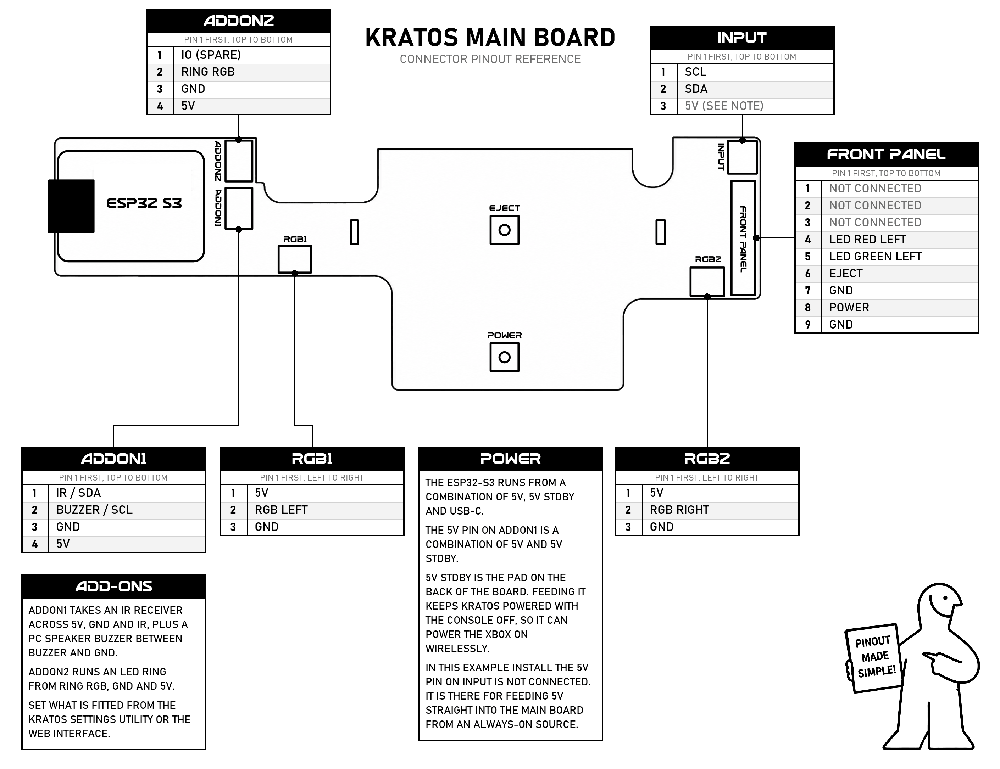
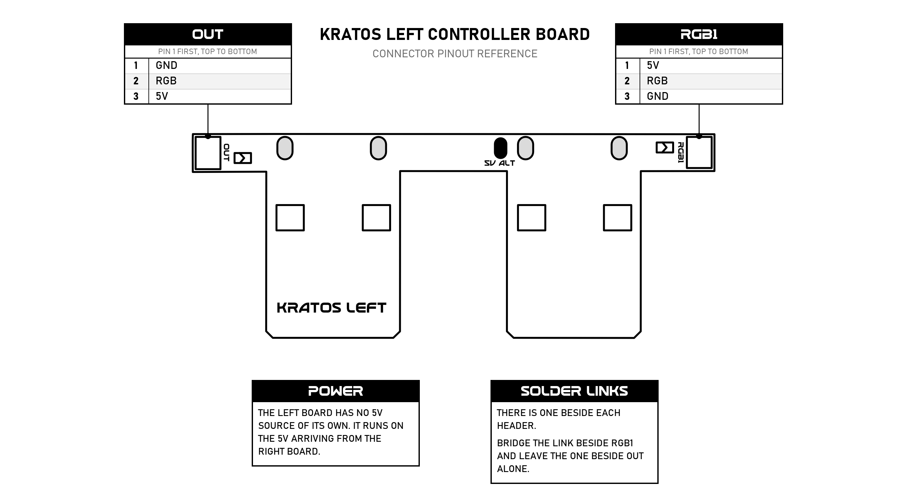
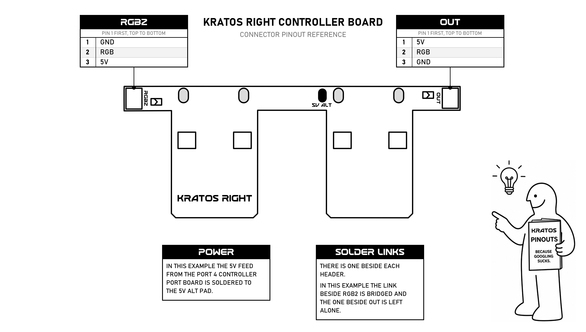

# Hardware Pinout Reference

A reference for the connectors and buttons on the Kratos boards. The installation parts tell you what to plug in and when - this page is here for when you want to identify something on a board itself. Click any diagram for a full-size version.

Where a pin or pad is described as connected or left alone, that is what the example install in this guide does with it - Kratos can be wired up other ways, particularly where its 5V comes from.

Left and right are as you face the front of the console, the same convention used in [Part 4](hardware-4-preparing-the-controller-ports.md).

## Kratos Main Board

### Connectors

- **FRONT PANEL** - The 9-pin header for the console's front panel cable. The connector is salvaged from the original front panel board and soldered on in [Part 5](hardware-5-preparing-the-kratos-main-board.md).
- **INPUT** - The 3-pin header carrying the SMBus lines and 5V. The two SMBus lines are wired to the console's SMBus in [Part 7](hardware-7-connecting-kratos-to-the-smbus.md). The 5V pin is not connected in this install example, so the harness has its 5V wire removed in [Part 5](hardware-5-preparing-the-kratos-main-board.md).
- **RGB1** and **RGB2** - The two 3-pin JST headers for the Controller Board Connection Cables, one per Kratos Controller Board. The connectors are keyed, so they only go in one way. Fitting these is covered in [Part 5](hardware-5-preparing-the-kratos-main-board.md).
- **ADDON1** - The header for the IR receiver and the buzzer. An IR receiver wires across **5V**, **GND** and the **IR** pin, and a PC speaker buzzer wires between the **BUZZER** pin and **GND**.
- **ADDON2** - The header an LED ring runs from, across **RING RGB**, **GND** and **5V**. Pin 1 is a spare IO line for future use.

Nothing in the standard kit plugs into either header. Kratos has a **Fitted add-on** setting for what you have connected - **None**, **Buzzer + IR**, or **External Addon** for a future board that will add audio playback on power on, power off, eject and more. You can set it from the Kratos Settings Utility on the console or from the web interface.

### Buttons

- **POWER** - The console power button.
- **EJECT** - The DVD drive eject button.

### Power

The 5V pins in the diagram are not all fed from the same place:

- The ESP32-S3 runs from a combination of **5V**, **5V STDBY** and USB-C.
- The 5V pin on **ADDON1** is a combination of **5V** and **5V STDBY**.
- The 5V pin on **INPUT** is not connected in this install example. It is otherwise a way in for 5V from an always-on source - the same sort of feed used for port 4, taken to the Kratos Main Board instead.

**5V STDBY** is the pad on the back of the board. Feeding it from an always-on source keeps Kratos powered while the console is off, which is what lets it power the Xbox on wirelessly, so it is only needed if you want that. Where the 5V comes from depends on the console: a 1.6 has an always-on supply on the motherboard to take it from ([Part 6b](hardware-6b-refitting-the-front-panel-1-6.md)), while 1.0 to 1.5 have none, so you supply your own or leave USB-C connected ([Part 6a](hardware-6a-refitting-the-front-panel-1-0-1-5.md)).

### Other Points of Interest

- **ESP32-S3** - The module that runs Kratos, including its WiFi.

## Kratos Left Controller Board

- **RGB1** - Takes the Controller Board Connection Cable from **RGB1** on the main board, plugged in during [Part 5](hardware-5-preparing-the-kratos-main-board.md).
- **OUT** - The pass-through header, carrying 5V, RGB and GND on from this board. How much you can hang off it depends on how many LEDs you are driving - a larger external string may need its own 5V source rather than taking power from here.
- **5V ALT** - A pad for feeding in 5V from the controller ports. Not used in this installation example.
- **Solder links** - There is one beside each header. In this example the link beside **RGB1** is bridged and the one beside **OUT** is left alone.

## Kratos Right Controller Board

- **RGB2** - Takes the Controller Board Connection Cable from **RGB2** on the main board, plugged in during [Part 5](hardware-5-preparing-the-kratos-main-board.md).
- **OUT** - The pass-through header, carrying 5V, RGB and GND on from this board. How much you can hang off it depends on how many LEDs you are driving - a larger external string may need its own 5V source rather than taking power from here.
- **5V ALT** - Where the 5V wire from the port 4 controller port board is soldered in this example, as covered in [Part 4](hardware-4-preparing-the-controller-ports.md).
- **Solder links** - There is one beside each header. In this example the link beside **RGB2** is bridged and the one beside **OUT** is left alone.

---

[← Back to Main Guide](README.md) | [Hardware Installation](hardware-installation.md)
