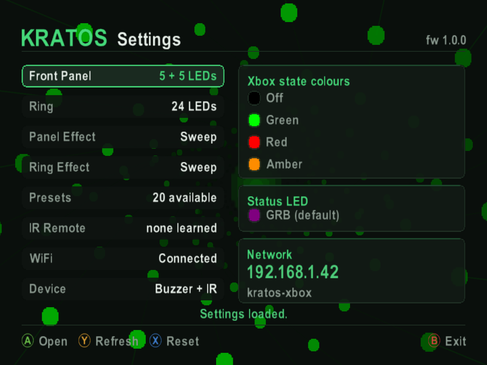
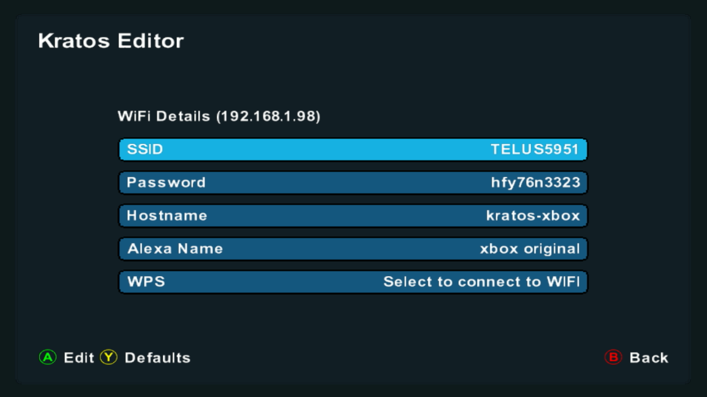
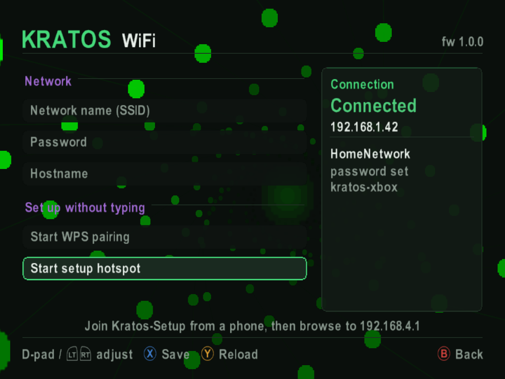
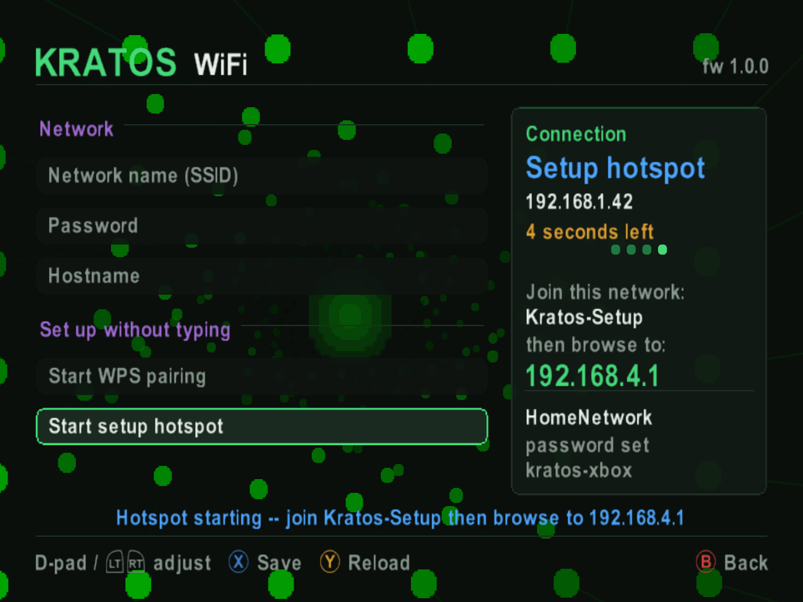

# WiFi Setup

Putting Kratos on your network is what enables the web interface, over-the-air updates and the voice assistant integrations. Everything else works without it, so this is optional, but it is worth doing.

There are three ways to connect, all on one page in the **Kratos Settings Utility** - the on-screen app you launch from your dashboard:

- **Your network details** - type in the SSID and password
- **WPS pairing** - press the WPS button on your router instead of typing a password
- **Setup hotspot** - Kratos hosts its own network and you enter the details from a phone

If Kratos is not installed yet, the same job can be done over USB-C with the boot button - see [Part 1: Before You Start](hardware-1-before-you-start.md).

## Opening the WiFi Page

### Step 1: Open the Kratos Settings Utility

Launch the Kratos Settings Utility from your dashboard. If it is not on your Xbox yet, download `KratosSettings.xbe` from the [releases page](../../releases) and copy it across.

Everything Kratos can be configured with is listed down the left, with its current state on the right - including the **Network** panel, which shows the IP address and hostname once it is on your network.

**A** opens the highlighted row, **Y** refreshes, **X** resets and **B** exits.

---

### Step 2: Select WiFi

Move down to the **WiFi** row, which shows the current connection state, and press **A** to open it.

---

### Step 3: The WiFi Page

Everything to do with the connection lives on this one page:

- **Network** - the **Network name (SSID)**, **Password** and **Hostname** fields
- **Set up without typing** - **Start WPS pairing** and **Start setup hotspot**
- **Connection** - the panel on the right, showing the current state, IP address, network name, whether a password is set, and the hostname

Move between rows with the D-pad, adjust the highlighted one with the D-pad or **LT** and **RT**, save with **X**, reload with **Y**, and go back with **B**.

---

## Method 1: Enter Your Network Details

If you know your network name and password, type them straight in:

1. Highlight **Network name (SSID)** and enter your network name
2. Do the same for **Password**
3. Optionally change **Hostname** - it defaults to `kratos-xbox`, which is the name the `.local` address uses
4. Press **X** to save

Kratos connects using the details you entered. The **Connection** panel on the right shows how it went, and displays the IP address once it is on the network.

---

## Method 2: WPS Pairing

WPS connects without a password, which saves entering one a character at a time. Your router needs to support WPS and have it enabled - check its admin settings if you are not sure.

### Step 1: Start WPS Pairing

Highlight **Start WPS pairing** and press **A**.

---

### Step 2: Press the Button on Your Router

The **Connection** panel switches to **WPS pairing** and counts down while Kratos listens, so press the WPS button on your router as soon as pairing starts. It is usually a physical button, either labelled WPS or marked with the WPS icon.

Kratos joins the network on its own once the router answers, and the **Connection** panel shows the result.

**Important:** The connection still has to complete inside your router's WPS window, typically 2 minutes. If the countdown runs out before the router answers, start pairing again.

---

## Method 3: Setup Hotspot

If typing on a controller does not appeal and your router has no WPS, Kratos can host its own network and take the details from your phone instead.

### Step 1: Start the Hotspot

Highlight **Start setup hotspot** and press **A**.

---

### Step 2: Join It from a Phone

The **Connection** panel shows the network to join and the address to open, and counts down while the hotspot is up.

1. On your phone, connect to the **Kratos-Setup** network
2. Browse to [http://192.168.4.1](http://192.168.4.1)
3. Enter your WiFi details and save
4. Switch your phone back to your home WiFi

---

## Web Interface Access

After successful WiFi setup, you can access the Kratos web interface from any device on your network:

1. **Find the IP address** - It is in the **Network** panel on the Settings home page, and in the **Connection** panel on the WiFi page
2. **Open a web browser** - On any device connected to the same WiFi network (computer, phone, tablet, etc.)
3. **Navigate to Kratos** - Enter the IP address in your browser's address bar, or use the hostname with `.local` (e.g., `http://kratos-xbox.local`)

The Kratos web interface provides advanced configuration options and additional features not available in the on-screen utility.

It also carries its own documentation, linked from the main menu: a guide to building your own lighting effects, a reference for the web API if you want to drive Kratos from your own scripts, and the protocol it speaks to the console over the internal bus.

## Changing WiFi Settings via Web Interface

You can also change WiFi settings after initial setup through the web interface, which provides a more convenient way to update network credentials:

1. Access the Kratos web interface using the IP address or hostname
2. Navigate to **System Configuration** from the main menu
3. Scroll to the **WiFi Configuration** section
4. Update your SSID, password, hostname, or Alexa name as needed
5. Click **Save Configuration** to apply the changes

**Note:** After changing WiFi settings (especially SSID or password), you may need to reconnect your device to the new network to continue accessing the web interface.

## Troubleshooting

### Standard WiFi Setup Issues

- **Can't find network:** Ensure your router is broadcasting the SSID and that your Xbox is within WiFi range. Try moving closer to the router if possible.
- **Connection fails:** Double-check your password for accuracy and ensure your network is 2.4GHz compatible (Kratos may not support 5GHz-only networks)
- **Wrong password:** Verify the password is correct, paying attention to case sensitivity and special characters. Some passwords are case-sensitive.

### WPS Setup Issues

- **WPS not working:** Some routers require WPS to be explicitly enabled in the router's admin settings. Check your router's configuration page.
- **Connection timeout:** Make sure you press the router's WPS button as soon as pairing starts on Kratos, and that the connection completes inside the 2-minute WPS window
- **WPS not available:** If your router doesn't support WPS, use Method 1 (Enter Your Network Details) or Method 3 (Setup Hotspot) instead
- **Router WPS disabled:** Access your router's admin panel and ensure WPS is enabled in the wireless settings

## Next Steps

Now that WiFi is configured, you can personalize your Kratos RGB LEDs and settings from the web interface, or from the Kratos Settings Utility on the Xbox itself.

---

[← Back to Main Guide](README.md) | [← Hardware Installation](hardware-installation.md)
