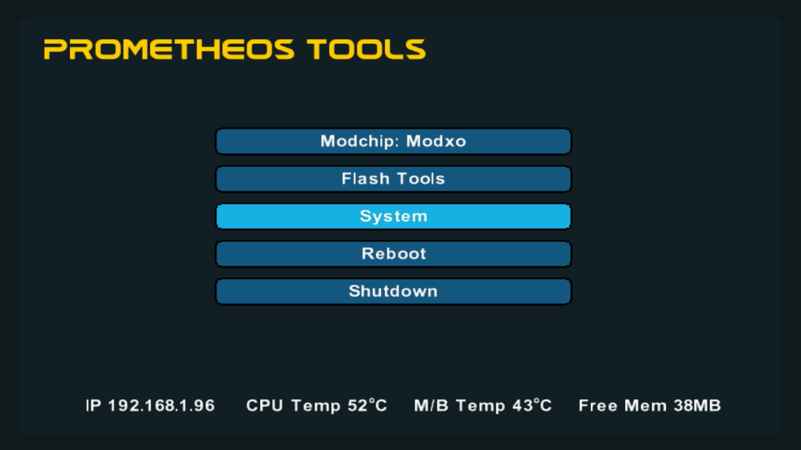
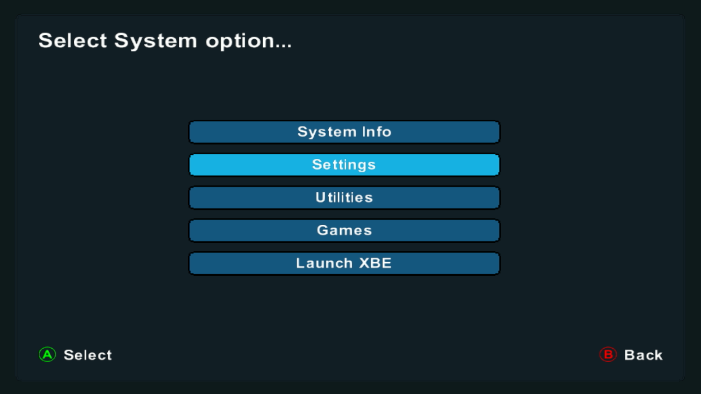
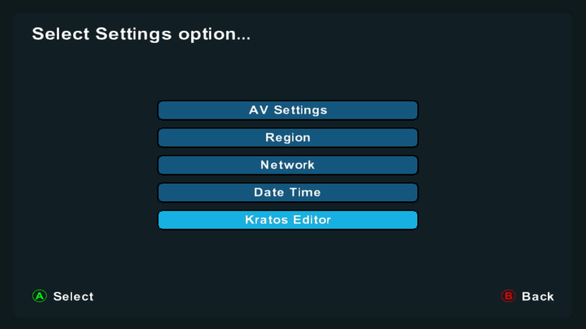
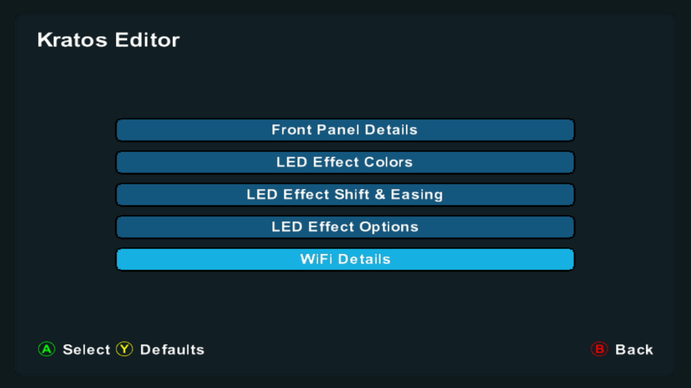

# WiFi Setup

This guide will help you configure the WiFi connection for your Kratos front button panel.

## Overview

Kratos supports WiFi connectivity with WPS (Wi-Fi Protected Setup) enabled, allowing you to configure it over a web interface or directly on the Xbox.

## Setup Steps

### Step 1: Initial WiFi Configuration

**Description:** Access the Kratos WiFi setup menu from your Xbox dashboard. Navigate to the Kratos settings section and select "WiFi Configuration" to begin the setup process.

---

### Step 2: Select Your Network

**Description:** The Kratos will scan for available WiFi networks. Select your network from the list of available networks. If your network supports WPS, you can use the WPS button for quick connection.

---

### Step 3: Enter Network Credentials

**Description:** Enter your WiFi network password using the on-screen keyboard. Make sure to enter the password correctly to ensure a successful connection.

---

### Step 4: Connection Confirmation

**Description:** Once connected, you'll see a confirmation screen showing your network name and connection status. The Kratos is now connected to your WiFi network and ready for web interface access.

---

## Web Interface Access

After successful WiFi setup, you can access the Kratos web interface by:

1. Finding the IP address assigned to your Kratos (displayed on the confirmation screen or in the Xbox settings)
2. Opening a web browser on any device connected to the same network
3. Navigating to the Kratos IP address

## Troubleshooting

- **Can't find network:** Ensure your router is broadcasting the SSID and is within range
- **Connection fails:** Double-check your password and ensure your network is 2.4GHz compatible (if applicable)
- **WPS not working:** Some routers require WPS to be enabled in router settings first

## Next Steps

Now that WiFi is configured, you can proceed to [Customization](customization.md) to personalize your Kratos RGB LEDs and settings.

---

[← Back to Main Guide](README.md) | [← Hardware Installation](hardware-installation.md) | [Next: Customization →](customization.md)

